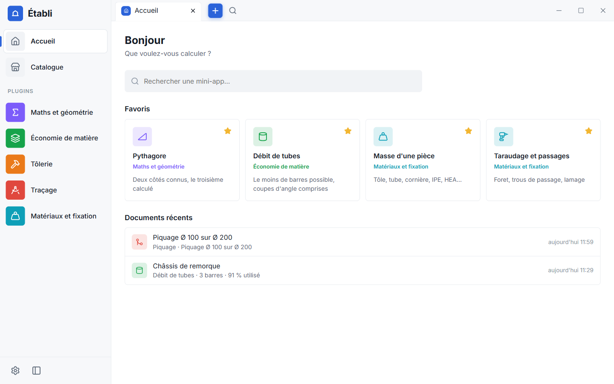
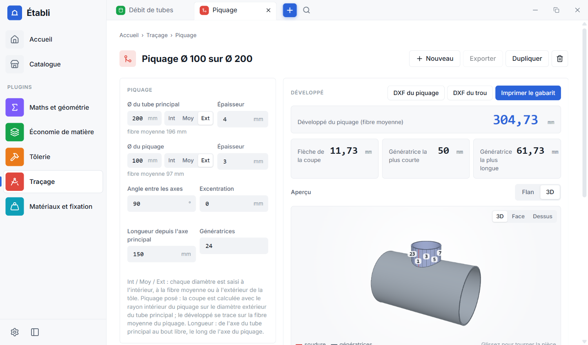

<h1 align="center">Établi</h1>

<p align="center">
  <strong>La boîte à outils de l'atelier</strong> : débit de tubes, calepinage de tôles, développés de pliage et de traçage,
  masses, taraudages, couples de serrage… Légère, 100 % locale, extensible par plugins.
</p>

<p align="center">
  <a href="https://github.com/Bryan-Cordonnier/etabli/releases/latest"></a>
  <a href="https://github.com/Bryan-Cordonnier/etabli/actions/workflows/ci.yml"></a>
  <a href="LICENSE"></a>
  
  <a href="CONTRIBUTING.md"></a>
</p>

<p align="center">
  
</p>

Établi est né d'un besoin d'atelier (BTS CRCI, chaudronnerie) : faire vite des calculs justes à côté de SolidWorks, sur un PC
modeste, sans compte ni connexion. C'est une **application de bureau Windows** dont chaque outil est un **plugin** : on installe
ceux dont on a besoin, et n'importe qui peut en écrire.

> **Outil d'aide, à vérifier.** Les résultats sont calculés avec soin (les formules sont testées sur des cas de référence) mais
> ils ne remplacent ni un bureau d'études, ni les normes, ni le contrôle en atelier. Vérifiez toujours avant de couper,
> plier ou souder. Établi est fourni « tel quel », sans garantie (voir la [licence](LICENSE)).

## Ce qu'il fait

- **Des calculs d'atelier** enregistrés automatiquement, retrouvables dans l'historique de chaque outil, dupliquables.
- **Des fiches imprimables** (A4, lisibles en noir et blanc) à emporter à l'atelier : fiche de coupe, calepinage, gabarit à
  l'échelle 1, tableaux de traçage.
- **Un aperçu rapide** : un raccourci clavier ouvre vos outils favoris par-dessus n'importe quel logiciel, sans le quitter.
- **Des exports** : DXF pour la CAO, tableaux copiables vers Excel, résultats copiables d'un clic.
- **Un catalogue de plugins** signés, installés et mis à jour sans redémarrer ; vos calculs sont conservés si vous désinstallez.
- **Zéro collecte de données.** Tout reste sur votre ordinateur ([confidentialité](CODE_SIGNING.md#confidentialité)).

<p align="center">
  
  
</p>

## Installer

1. Téléchargez **`Etabli_…_x64_fr-FR.msi`** sur la page de la [dernière version](https://github.com/Bryan-Cordonnier/etabli/releases/latest).
2. Lancez-le : l'installation se fait pour votre compte, **sans droits d'administrateur**.
3. Si Windows affiche « Windows a protégé votre ordinateur » : cliquez sur **Informations complémentaires** puis **Exécuter quand même**.
   L'installateur n'est pas encore signé (demande en cours auprès de la SignPath Foundation, voir la
   [politique de signature](CODE_SIGNING.md)). Sur un PC où le *Contrôle intelligent des applications* est activé, Windows le
   bloque sans recours : désactivez-le le temps de l'installation.

Au premier lancement, Établi est **vide** : ouvrez le **Catalogue** pour installer les plugins qui vous intéressent. Ensuite,
Établi cherche seul les nouvelles versions, de l'application comme des plugins.

Guide complet : [docs/guide-utilisateur.md](docs/guide-utilisateur.md).

## Les plugins officiels

| Plugin | Mini-apps |
| --- | --- |
| **Maths et géométrie** | Pythagore, triangle, arc et cercle, perçage sur cercle, polygone régulier, volumes et contenances, conversions |
| **Économie de matière** | Débit de tubes (coupes d'angle, tolérances, chutes, 2D et 3D), calepinage de tôles à la cisaille |
| **Tôlerie** | Développé de pliage, vé et effort de pliage |
| **Traçage** | Développés façon Logitrace : virole, cône, piquage, coude, trémie ; DXF et gabarits |
| **Matériaux et fixation** | Masse d'une pièce, taraudage et passages, vitesse de coupe, couple de serrage |
| **Fournisseurs** | Réglages : la matière que vend chaque fournisseur (longueurs, formats, tolérances, prix) |
| **Machines** | Réglages : scies et cisailles de l'atelier |

Les plugins peuvent **dépendre les uns des autres** (par exemple Économie de matière profite de Fournisseurs et de Machines) : le
catalogue installe ce qui manque, après confirmation.

## Écrire un plugin

Un plugin est un dossier avec un manifeste et des mini-apps : des pages web (ici en Svelte) affichées dans un cadre isolé, sans
accès au disque ni au réseau, reliées à Établi par un petit [SDK](packages/sdk/README.md).

```bash
git clone https://github.com/Bryan-Cordonnier/etabli.git && cd etabli
npm install
npm run nouveau-plugin -- soudage "Soudage"     # crée plugins/soudage avec une mini-app d'exemple
npm run dev                                      # lance Établi avec votre plugin
npm run valider -- soudage                       # vérifie le manifeste et le contenu
```

- Guide pas à pas : [docs/07-creer-un-plugin.md](docs/07-creer-un-plugin.md)
- Protocole et SDK : [docs/06-protocole-sdk.md](docs/06-protocole-sdk.md)
- Proposer votre plugin au catalogue officiel : [CONTRIBUTING.md](CONTRIBUTING.md#écrire-un-plugin)

## Contribuer

Bugs, calculs faux, idées, plugins, relecture de formules, documentation : tout est bienvenu, en français.
Lisez le [guide de contribution](CONTRIBUTING.md) et le [code de conduite](CODE_OF_CONDUCT.md).

- Un problème ? [Ouvrez un ticket](https://github.com/Bryan-Cordonnier/etabli/issues/new/choose).
- Une question ? Voyez [SUPPORT.md](SUPPORT.md).
- Une faille de sécurité ? **Pas de ticket public** : [SECURITY.md](SECURITY.md).
- Ce qui a changé : le [journal des changements](CHANGELOG.md). Ce qui est prévu : la [feuille de route](ROADMAP.md).

## Développer Établi

Prérequis : Windows 10 ou 11, Node.js 24 (22.18 au minimum), Rust stable (toolchain MSVC), Build Tools Visual Studio (C++),
WebView2. Détails : [docs/02-environnement.md](docs/02-environnement.md).

```bash
npm install        # dépendances
npm run dev        # compile les plugins puis lance l'application
npm run build      # produit l'installateur Windows
npm run check      # types (moteur, SDK, plugins)
npm test           # tests des calculs des plugins, du SDK et du kit
npm run test:scripts   # tests des scripts de publication
npm run valider -- --tous   # vérifie tous les plugins
npm run liens      # vérifie les liens de la documentation
```

Pour reprendre le code : [AGENTS.md](AGENTS.md) est le sommaire de la [documentation technique](docs/README.md).

```
apps/desktop/        le moteur : application Tauri 2 (Rust) + interface Svelte 5
packages/sdk/        @etabli/sdk : protocole et API des mini-apps
packages/ui/         @etabli/ui : champs, résultats copiables, cartes, document enregistré automatiquement
plugins/             les plugins officiels (un dossier chacun)
scripts/             publication, validation et création de plugins
docs/                documentation (utilisateur, plugins, technique)
```

## Crédits et licence

Établi est publié sous [licence MIT](LICENSE) par [Bryan Cordonnier](https://github.com/Bryan-Cordonnier) et ses contributeurs.
Il repose sur [Tauri](https://tauri.app), [Svelte](https://svelte.dev), [three.js](https://threejs.org), [Lucide](https://lucide.dev)
et d'autres projets libres : voir [THIRD-PARTY.md](THIRD-PARTY.md).
