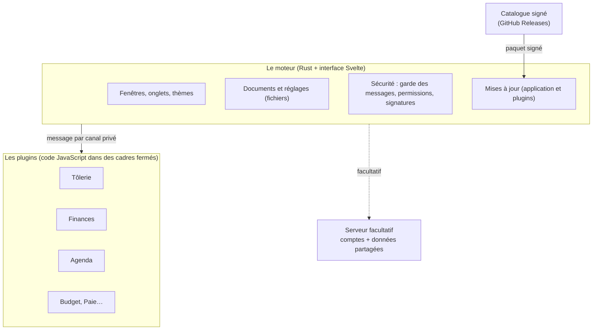
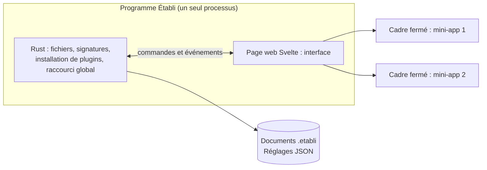
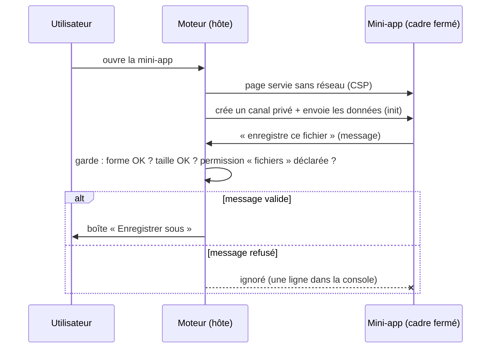
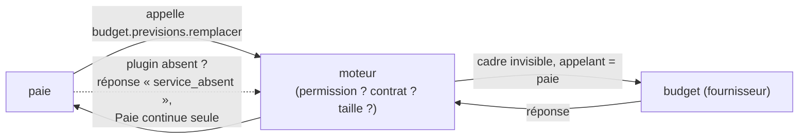
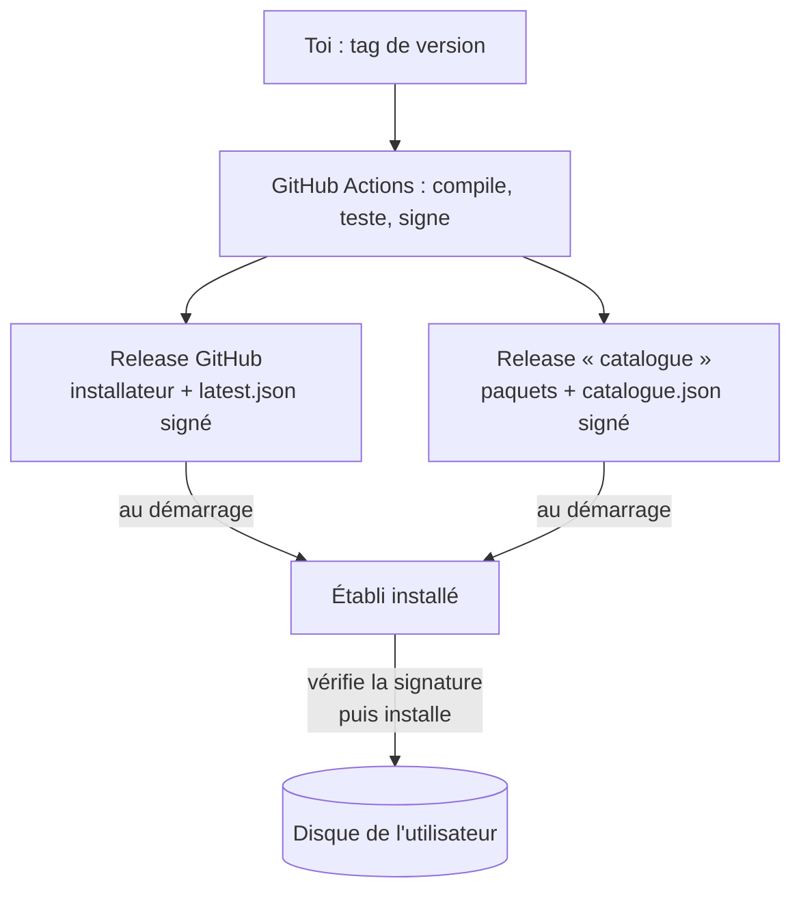
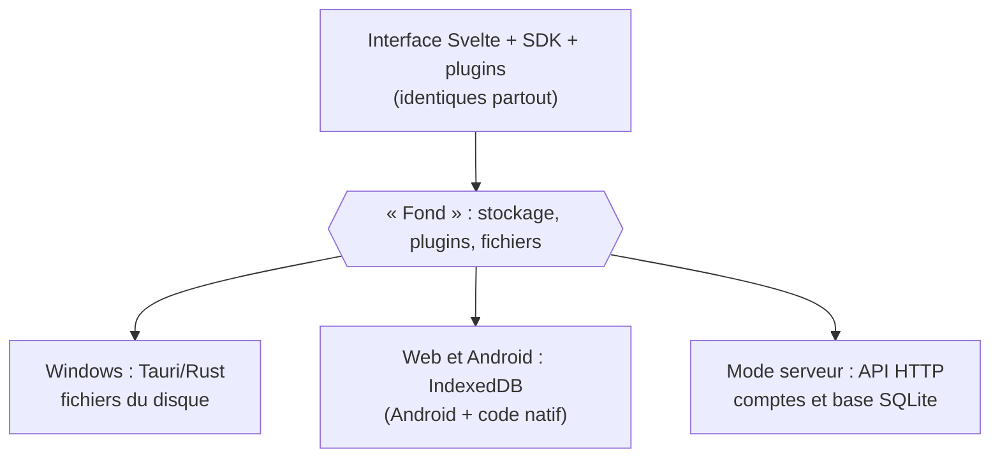
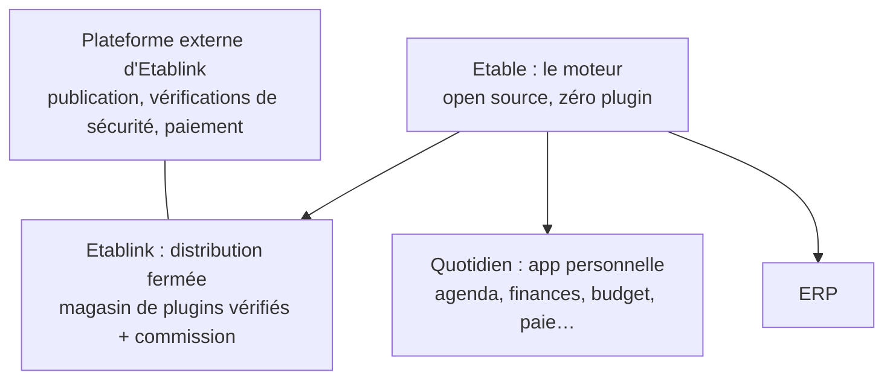

# 25 — Comment tout fonctionne aujourd'hui (en clair)

> **Pour Bryan.** Ce document décrit ce qui existe **aujourd'hui**, avant le changement de plan (moteur « Etable » sans plugin,
> distribution fermée « Etablink », Quotidien, ERP). Il ne propose rien : il sert à bien comprendre, pour décider ensuite.
> Chaque affirmation vient de la documentation du dépôt ou du code. Ce qui n'a **jamais été essayé** est marqué ⚠️.
> Les schémas s'affichent sur GitHub (Mermaid).

## 1. L'image d'ensemble : un atelier

| Dans l'atelier | Dans Établi |
| --- | --- |
| L'**établi** : le plan de travail, les étaux, le rangement | le **moteur** : fenêtres, enregistrement, impression, mises à jour, sécurité |
| Les **outils** qu'on pose dessus | les **plugins** (Maths, Tôlerie, Finances, Agenda…) |
| Un outil précis (la cisaille, le pied à coulisse) | une **mini-app** (un calcul de pliage, un tableau de budget) |
| Le **magasin d'outils** | le **catalogue** de plugins |
| Le sceau « outil vérifié » | la **signature** : sans elle, le moteur refuse d'installer |
| L'armoire commune de l'atelier | le **serveur** facultatif (comptes, données partagées) |

Le moteur ne connaît aucun métier : il ne sait pas ce qu'est un développé de pliage. Il sait seulement ouvrir une mini-app dans un
cadre fermé, lui passer ses données, enregistrer ce qu'elle produit, et la protéger des autres.

## 2. De quoi est fait le dépôt aujourd'hui

| Dossier | Ce que c'est |
| --- | --- |
| `apps/desktop/src-tauri/` | le **cœur en Rust** : fenêtres, fichiers, installation de plugins, vérification des signatures |
| `apps/desktop/src/` | l'**interface** (Svelte 5) : colonne de plugins, onglets, paramètres, page Catalogue |
| `packages/sdk/` | le **SDK** : le « langage » que parlent le moteur et une mini-app |
| `packages/ui/` | la boîte à composants des mini-apps (champs, graphiques, calcul d'argent, dates) |
| `plugins/*` | **11 plugins** : Maths, Économie, Tôlerie, Traçage, Matériaux, Fournisseurs, Machines, Finances, Agenda, Budget, Paie |
| `crates/noyau/`, `crates/serveur/` | les règles communes en Rust et le **serveur facultatif** |
| `apps/mobile/` | l'emballage **Android** (Capacitor) |

Aujourd'hui le moteur et les plugins vivent **dans le même dépôt**, et l'installateur de l'application ne contient **aucun plugin** : ils
s'installent depuis le catalogue (depuis la version 0.2.0).

## 3. L'application Windows

C'est une application **Tauri 2** : un petit programme Rust qui affiche une page web dans le moteur d'affichage de Windows (WebView2).
Rust fait tout ce qui touche au disque et à Windows ; la page web (Svelte) fait l'interface.

Données sur le disque : tes calculs dans `Documents\Etabli\<plugin>\…etabli` (du JSON lisible), les réglages dans `%APPDATA%\Etabli`.
Désinstaller un plugin supprime son code, **jamais tes calculs**.

## 4. Le bac à sable : comment un plugin est enfermé

Un plugin est du code qu'on ne maîtrise pas (aujourd'hui le tien, demain peut-être celui d'un tiers). On suppose donc le pire : un plugin
**hostile**, signé, installé de bonne foi. Il y a sept barrières, de l'extérieur vers l'intérieur :

1. **Signature** : le moteur n'installe qu'un paquet signé par une clé de confiance.
2. **Cadre fermé** : la mini-app tourne dans un `<iframe sandbox>` : elle n'a ni cookies, ni stockage commun, ni accès à la page du moteur.
3. **Aucun réseau** : la page est servie avec une règle de sécurité (CSP) qui interdit toute connexion. Une mini-app ne peut parler à personne.
4. **Origine propre** : chaque plugin est servi sous sa propre adresse, pour que deux plugins ne se voient jamais.
5. **Canal privé** : la mini-app ne parle au moteur que par un « tuyau » (`MessagePort`) créé exclusivement pour elle.
6. **Garde du moteur** : chaque message est contrôlé (forme, taille, **permission**) avant d'être pris en compte. Un message invalide est ignoré.
7. **Permissions** : le manifeste du plugin liste ce dont il a besoin (enregistrer un fichier, imprimer, notifications…). L'utilisateur les voit **avant** l'installation.

Ce qui est vérifié : une suite de 62 essais automatiques dans un vrai navigateur (Chromium) joue des plugins hostiles contre ces barrières, à
chaque modification. ⚠️ Rien n'a été essayé sous WebView2 (Windows) ni sur un vrai téléphone : les essais tournent sur Chromium (Linux).
Limite assumée : une boucle infinie dans un plugin peut ralentir son propre cadre (pas encore de coupure automatique).

## 5. Les plugins qui se parlent

Deux mécanismes, tous deux facultatifs et contrôlés :

- **Un service publié** : un plugin (Fournisseurs, Machines) publie des données que d'autres peuvent lire.
- **Un appel de fonction** (nouveau) : `paie` peut demander à `budget` « ajoute cette prévision ». Le moteur vérifie la **permission**
  (affichée à l'installation), ouvre le plugin fournisseur dans un **cadre invisible** le temps d'un appel, lui transmet la demande **avec
  l'identité de l'appelant imposée par le moteur** (un plugin ne peut pas se faire passer pour un autre), puis ferme le cadre.
  Un fournisseur ne peut pas lui-même en appeler un autre (profondeur 1).

## 6. Les mises à jour : par quelle voie ?

Il y a **deux voies indépendantes**, qui passent toutes deux par GitHub, avec la **même clé de signature** (minisign).

| | Application (le moteur) | Plugins |
| --- | --- | --- |
| **Où** | Releases GitHub du dépôt (`releases/latest`) | Release GitHub spéciale « catalogue » |
| **Fichiers** | installateur `.msi`, sa signature, `latest.json` | un paquet `.etabli-plugin` par plugin + `catalogue.json` + sa signature |
| **Qui regarde** | l'application installée, au démarrage | l'application, au démarrage (et page Catalogue) |
| **Vérification** | signature vérifiée avec la clé publique **intégrée à l'application** | idem, avant d'écrire quoi que ce soit sur le disque |
| **Qui publie** | toi : tag de version, workflow GitHub | toi : tag `plugin-<id>-vX`, workflow GitHub |

Protections du catalogue : un **numéro de séquence** qui ne fait qu'augmenter (on ne peut pas rejouer un vieux catalogue), une **date
d'expiration de 30 jours** (renouvelée chaque mois par un workflow), une liste de **révocations** (retirer une version dangereuse), et le
**retour à la version précédente** d'un plugin. Une liste de clés avec une **clé racine** est préparée mais **tu ne l'as pas encore créée** :
tant qu'elle n'existe pas, tout repose sur une seule clé.

## 7. Les quatre façons de faire tourner Établi

| | **Windows (installateur)** | **Navigateur / PWA** | **Android** | **Serveur facultatif** |
| --- | --- | --- | --- | --- |
| Ce que c'est | Tauri : Rust + WebView2 | la même interface, sans Rust, installable depuis un navigateur | la version web emballée par **Capacitor**, + un peu de Java | un programme Rust (axum + SQLite) qui sert les comptes et les données |
| Où sont les données | fichiers sur le disque | **IndexedDB** du navigateur | stockage de l'application (comme la version web) | sa base SQLite ; l'application s'y connecte |
| Plugins | **catalogue** (installés à la demande) | ceux **fournis avec le build** | ceux **fournis avec le build** (pas de catalogue en local) | l'**administrateur** les installe et les distribue |
| Mises à jour | automatiques (voie ci-dessus) | au rechargement de la page ⚠️ (comportement du cache hors ligne non vérifié) | **nouvel APK** à installer (aucun magasin d'applications aujourd'hui) | à la main : tu remplaces le programme |
| Enfermement des plugins | cadre fermé + origine opaque | cadre fermé ; strict si l'hébergement envoie les bons en-têtes, sinon repli moins strict dont les failles sont listées dans `docs/19` §7 | cadre fermé + **une adresse par plugin** posée par le code Java ⚠️ | domaine par plugin |
| Rappels | non (décidé) | non | **oui** : notifications exactes ⚠️ jamais essayé | — |
| Raccourci global, zone de notification, démarrage avec Windows | oui | non | non | — |

Retiens ceci : **c'est la même interface Svelte partout**. Seule change la couche du dessous (Rust sur PC, navigateur sur le web, Capacitor
sur Android). Cette couche s'appelle le « fond » dans le code : un seul contrat, trois réalisations (Tauri, IndexedDB, serveur).

## 8. Les rappels sur le téléphone

Une mini-app ne peut pas appeler elle-même les notifications du téléphone (barrière 3 et 5). Elle envoie au moteur un message `reminders`
(permission **notifications**) ; le moteur, seul, parle au plugin de notifications de Capacitor. Le moteur remplace **la liste complète**
des rappels du plugin demandeur (jamais ceux d'un autre), ne programme que les **60 prochains jours** (le plugin renvoie sa liste à chaque
ouverture pour renouveler). Notifications seulement, jamais d'alarme, rien sur PC. ⚠️ **Jamais sonné sur un vrai téléphone.**

## 9. Ce qui n'a pas été vérifié

- Aucun écran des plugins Quotidien (Finances, Agenda, Budget, Paie) n'a été ouvert ; aucun rappel n'a sonné.
- L'application n'a pas été essayée sous WebView2 depuis les derniers changements (appels entre plugins, permissions, catalogue signé).
- Le Java d'Android **compile** (l'APK de test est produit par GitHub) mais n'a jamais tourné sur un téléphone.
- La clé racine de publication n'existe pas ; la signature Windows (SignPath) est décrite dans `docs/14`, je n'ai pas vérifié qu'elle est active.
- Rien n'est publié depuis le 3 octobre : la dernière version (0.5.0) ne contient ni les rappels, ni les appels entre plugins, ni Quotidien.

## 10. Ton nouveau plan, posé sur ce qui existe (pour la discussion)

Ce que tu as décrit : **Etable** (le moteur, 100 % open source, **aucun plugin**), **Etablink** (distribution fermée, avec sa plateforme de
plugins façon magasin d'applications, vérifications et commission), **Quotidien** (usage personnel), puis l'**ERP**.

Ce qui change par rapport à aujourd'hui (constat, pas décision) :

| Sujet | Aujourd'hui | Dans ton plan |
| --- | --- | --- |
| Plugins dans le dépôt du moteur | 11 | **0** |
| Catalogue, paquets signés, révocation, retour arrière | dans le moteur et sur GitHub | **sur la plateforme externe** d'Etablink |
| Qui publie un plugin | toi, par un tag GitHub | des tiers, via ton site |
| Licence | MIT (dépôt public) | moteur open source ; Etablink **fermé** |
| Quotidien | 4 plugins dans le dépôt | une **distribution** : le moteur + ces plugins, empaquetés ensemble |
| Plugins de Bryan (Maths, Tôlerie…) | dans le dépôt | à décider (distribution à eux ? ou exemples ?) |

Les questions à trancher ensemble sont dans la conversation. Le plus important : **le moteur a-t-il encore besoin d'un système de
plugins si Quotidien et l'ERP sont fermés ?** (voir la discussion).
