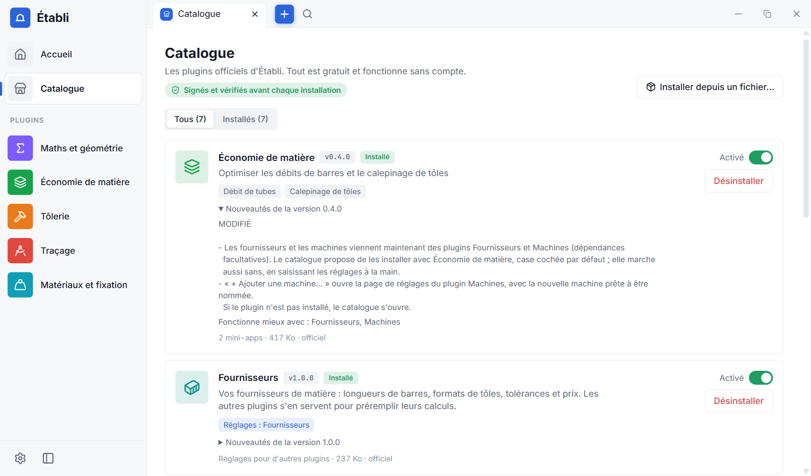
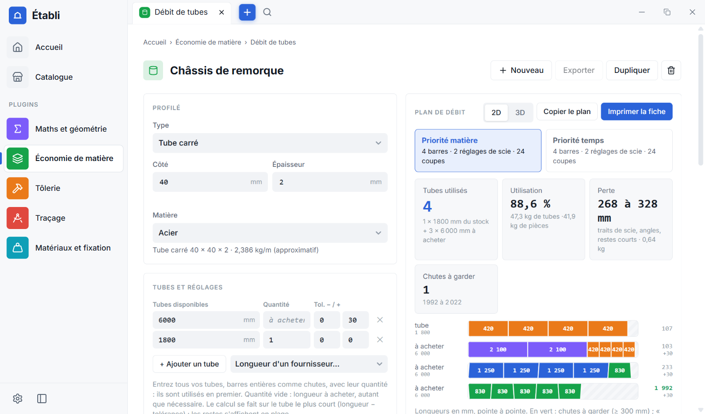
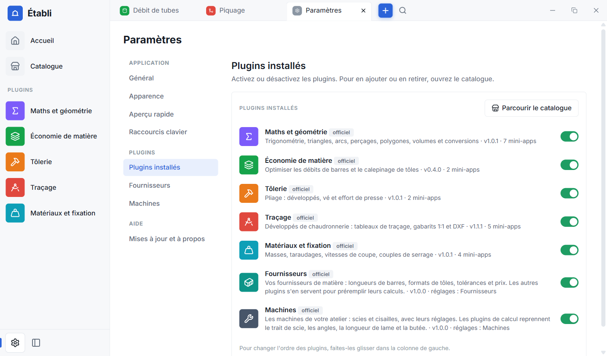
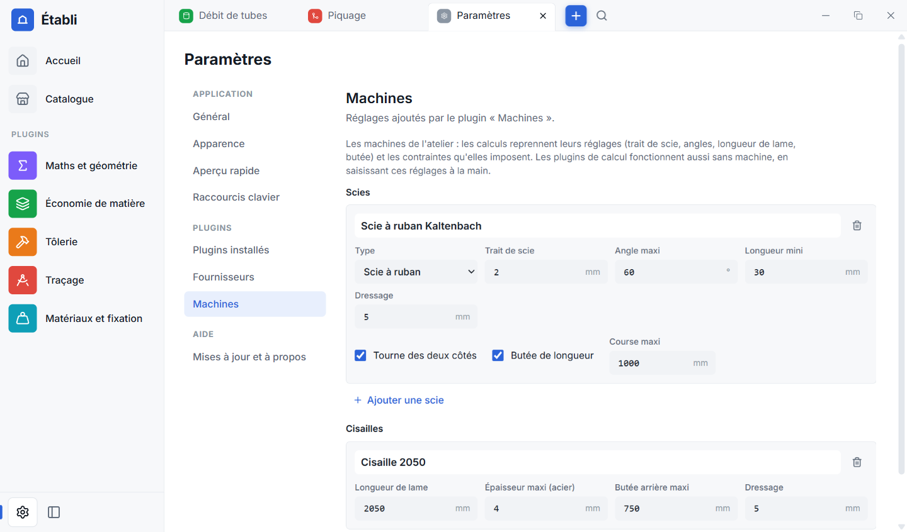

# Guide de l'utilisateur

> **Out of date (6 October 2026).** The project is changing direction: this repository becomes **Etable**, an open-source engine with no bundled plugins; the metalworking plugins described below were removed (tag `legacy/etabli-0.5-chaudronnerie`). Current plan: [22-cahier-de-bord.md](22-cahier-de-bord.md), section 9. This document will be rewritten in English.

Établi est une application Windows qui rassemble des outils de calcul d'atelier. Chaque outil est une **mini-app**, rangée dans
un **plugin** ; on installe les plugins dont on a besoin. Rien n'est envoyé sur Internet, à part la recherche de mises à jour
et les téléchargements que vous demandez.

> **Outil d'aide, à vérifier.** Contrôlez toujours un résultat avant de couper, plier ou souder. Voir la
> [licence](../LICENSE) (fourni « tel quel »).

## Sommaire

- [Installer](#installer) · [Premier lancement](#premier-lancement) · [Le catalogue](#le-catalogue)
- [Utiliser une mini-app](#utiliser-une-mini-app) · [Les onglets](#les-onglets) · [L'aperçu rapide](#laperçu-rapide)
- [Raccourcis clavier](#raccourcis-clavier) · [Les Paramètres](#les-paramètres)
- [Fournisseurs et machines](#fournisseurs-et-machines) · [Où sont mes données](#où-sont-mes-données)
- [Mises à jour](#mises-à-jour) · [Désinstaller](#désinstaller) · [Dépannage](#dépannage)

## Installer

1. Téléchargez **`Etabli_…_x64_fr-FR.msi`** sur la page de la [dernière version](https://github.com/Bryan-Cordonnier/etabli/releases/latest).
2. Double-cliquez dessus : l'installation se fait **pour votre compte**, sans droits d'administrateur, dans
   `%LOCALAPPDATA%\Programs\Etabli`. Un raccourci est ajouté au menu Démarrer et au Bureau.
3. Windows peut afficher **« Windows a protégé votre ordinateur »** : l'installateur n'est pas encore signé. Cliquez sur
   **Informations complémentaires** puis **Exécuter quand même**. Si votre PC utilise le *Contrôle intelligent des applications*
   (Windows 11), il bloque le programme sans proposer cette option : désactivez-le dans *Sécurité Windows → Contrôle des
   applications et du navigateur* pendant l'installation.

Windows 10 et 11 sont pris en charge (il faut le composant WebView2 de Microsoft, présent sur Windows 11 et sur la plupart des Windows 10 à jour).

## Premier lancement

Établi est **vide** : il ne contient aucun outil. Cliquez sur **Ouvrir le catalogue pour installer des plugins**. Sans connexion
Internet, vous pouvez installer un plugin reçu d'un camarade avec **Installer depuis un fichier…** (fichier `.etabli-plugin`).

## Le catalogue

La page **Catalogue** (colonne de gauche) liste les plugins officiels, tous **signés** : Établi vérifie la signature avant
d'écrire quoi que ce soit sur votre disque.

- **Installer** : un clic, sans redémarrer. Le plugin apparaît dans la colonne de gauche.
- **Nouveautés** : dépliez « Nouveautés de la version… » sur une carte pour voir ce qui a changé.
- **Dépendances** : certains plugins ont **besoin** d'autres plugins (« A besoin de : … »), ou fonctionnent **mieux avec** eux
  (« Fonctionne mieux avec : … »). Établi vous le dit avant d'installer :
  - les plugins nécessaires sont installés automatiquement, après confirmation ;
  - les extensions facultatives sont proposées avec une **case cochée par défaut** : décochez-la si vous n'en voulez pas.
- **Activer / désactiver** : l'interrupteur d'un plugin le masque sans le désinstaller. Désactiver un plugin dont d'autres ont
  besoin les désactive aussi (après confirmation).
- **Désinstaller** : retire le plugin. **Vos calculs et vos réglages sont conservés** : vous les retrouvez si vous le réinstallez.
- **Mises à jour** : au démarrage, Établi installe les nouvelles versions des plugins et vous prévient.

## Utiliser une mini-app

Ouvrez une mini-app depuis la colonne de gauche, l'accueil (recherche et **favoris** : l'étoile d'une tuile) ou la **loupe** de la
barre d'onglets.

- Les **champs numériques acceptent les calculs** : `1200 - 2*15` donne 1170, le résultat s'affiche sous le champ.
- **Cliquer sur un résultat le copie.** Les tableaux se copient vers Excel.
- Le calcul est **enregistré automatiquement** dans un fichier `.etabli` ; le titre se change en cliquant dessus.
  **Nouveau** ouvre un calcul vierge ; **Dupliquer** en fait une copie ; la corbeille déplace le calcul dans `.corbeille`
  (rien n'est détruit d'un coup).
- **Anciens calculs** : en bas de chaque mini-app, avec une recherche. Un clic rouvre le calcul.
  Choisissez « Enregistrer au format PDF » pour un fichier. Votre nom, s'il est renseigné dans les Paramètres, figure sur la fiche.
- **Exports** : DXF pour la CAO et gabarits à l'échelle 1 (imprimez à 100 %, sans « ajuster à la page » : mesurez la règle de 100 mm).
- **Envoyer à…** : une mini-app peut envoyer son résultat à une autre (par exemple un développé de pliage vers le
  calepinage de tôles).

## Les onglets

Comme dans un navigateur : **+** pour un nouvel onglet, **clic molette** ou la croix pour fermer, **glisser** pour réordonner,
**Ctrl + clic** sur un lien pour l'ouvrir dans un nouvel onglet, bouton « précédent » de la souris pour revenir. Les onglets ouverts
sont retrouvés au prochain démarrage. Une mini-app en cours n'est jamais remplacée : on ouvre un nouvel onglet.

## L'aperçu rapide

Un raccourci clavier global (**Ctrl + Maj + Espace** par défaut, modifiable) ouvre une fenêtre légère par-dessus n'importe quel
logiciel, SolidWorks compris, avec vos **favoris**. Flèches et **Entrée** pour choisir, touches **1 à 9** pour un accès direct,
**Échap** pour revenir puis fermer. **Ouvrir dans l'Établi** poursuit le calcul dans la fenêtre principale.

Pour qu'il soit disponible, Établi doit tourner : laissez-le **en arrière-plan** (réglage ci-dessous) ou faites-le démarrer avec Windows.

## Raccourcis clavier

**Aucun raccourci n'est réglé d'avance**, sauf celui de l'aperçu rapide. Dans *Paramètres → Raccourcis clavier*, cliquez sur la case
d'une action (recherche, nouvel onglet, fermer l'onglet, onglet suivant, replier la colonne…), puis appuyez sur la combinaison voulue :
Ctrl ou Alt avec une lettre, un chiffre ou une flèche (les touches F1 à F12 peuvent servir seules). Un raccourci déjà pris par une
autre action est refusé ; « Effacer » le retire. Les mini-apps respectent vos raccourcis et gardent le reste du clavier.

## Les Paramètres

- **Général** : Établi **reste en arrière-plan** ou **se ferme complètement** quand on ferme la fenêtre (en arrière-plan, on le quitte par
  clic droit sur son icône près de l'horloge → Quitter) ; **démarrage avec Windows** (Établi démarre réduit, sans fenêtre) ; **votre nom**
  pour les fiches ; dossier de travail.
- **Apparence** : thème (comme Windows, clair, sombre, Atelier, Papier, ou un thème importé au format JSON), taille du texte,
  réduction des animations.
- **Aperçu rapide** : le raccourci global et les favoris affichés.
- **Plugins installés** : activer ou désactiver, et voir ce dont chacun a besoin.
- **Une page par plugin qui ajoute des réglages** (Fournisseurs, Machines…), affichée seulement quand le plugin est installé.
- **Mises à jour et à propos** : version, recherche de mises à jour, **Signaler un problème** (ouvre un ticket avec la version et les
  plugins déjà remplis, sans donnée personnelle).

## Fournisseurs et machines

Deux plugins optionnels. **Fournisseurs** : pour chaque fournisseur, la matière qu'il vend (type de profilé ou tôle, nuance,
dimension, longueur de barre ou format de tôle, tolérance, prix facultatif). **Machines** : vos scies (trait de scie, angle maxi,
butée…) et cisailles (longueur de lame, épaisseur maxi, butée arrière). Les outils de calcul qui les connaissent (Économie de
matière) préremplissent leurs formulaires et proposent vos machines ; ils fonctionnent aussi sans. Dans un calcul,
**« + Ajouter une machine… »** ouvre directement la page de réglages du plugin Machines.

## Où sont mes données

| Quoi | Où |
| --- | --- |
| Vos calculs (`.etabli`) | `Documents\Etabli\<plugin>\` |
| Calculs supprimés | `Documents\Etabli\.corbeille\` |
| Réglages, onglets ouverts | `%APPDATA%\Etabli\settings.json` |
| Réglages des plugins, fournisseurs, machines | `%APPDATA%\Etabli\donnees\` |
| Plugins installés depuis le catalogue | `%APPDATA%\Etabli\catalogue\` |
| Plugins déposés à la main | `%APPDATA%\Etabli\plugins\` |

**Sauvegarde** : copiez `Documents\Etabli` (vos calculs) et `%APPDATA%\Etabli\donnees` (fournisseurs, machines, réglages de plugins).
**Partager un calcul** : envoyez le fichier `.etabli` ; le destinataire le dépose dans `Documents\Etabli\<plugin>\` (il faut qu'il ait le
même plugin installé).

Tout est du texte JSON lisible. Établi ne collecte rien et n'envoie rien.

## Mises à jour

Cinq secondes après l'ouverture, Établi regarde sur GitHub s'il existe une nouvelle version (désactivable : *Paramètres → Mises à jour et
à propos → Chercher au démarrage*). Un bandeau propose **Installer et redémarrer** ; les notes de la version sont affichées. Rien ne
s'installe sans votre clic, la mise à jour est **signée** et vos calculs ne sont pas touchés. Les plugins, eux, se mettent à jour seuls
au démarrage (vous êtes prévenu).

## Désinstaller

*Paramètres Windows → Applications → Établi → Désinstaller.* Vos calculs (`Documents\Etabli`) et vos réglages (`%APPDATA%\Etabli`)
restent sur le disque : supprimez ces dossiers si vous voulez tout effacer.

## Dépannage

| Problème | Que faire |
| --- | --- |
| Windows bloque l'installateur | Voir [Installer](#installer). |
| Établi est vide | Normal au premier lancement : ouvrez le **Catalogue**. |
| Le catalogue ne se charge pas | Vérifiez la connexion à Internet, puis **Réessayer**. Sans réseau : **Installer depuis un fichier…**. |
| Un plugin dit « Il faut installer X » | Il dépend d'un autre plugin : le bouton l'installe. |
| Un plugin a disparu de la colonne | Il est peut-être désactivé (Catalogue ou Paramètres → Plugins installés), ou il n'a que des réglages (Paramètres). |
| Le raccourci de l'aperçu ne répond pas | Une autre application l'utilise peut-être : changez-le dans *Paramètres → Aperçu rapide*. Établi doit tourner (arrière-plan ou démarrage avec Windows). |
| Je ne retrouve plus un calcul | Regardez la corbeille (`Documents\Etabli\.corbeille`), ou les anciens calculs de la mini-app. |
| Autre | [Ouvrez un ticket](https://github.com/Bryan-Cordonnier/etabli/issues/new/choose) : voir [SUPPORT.md](../SUPPORT.md). |
